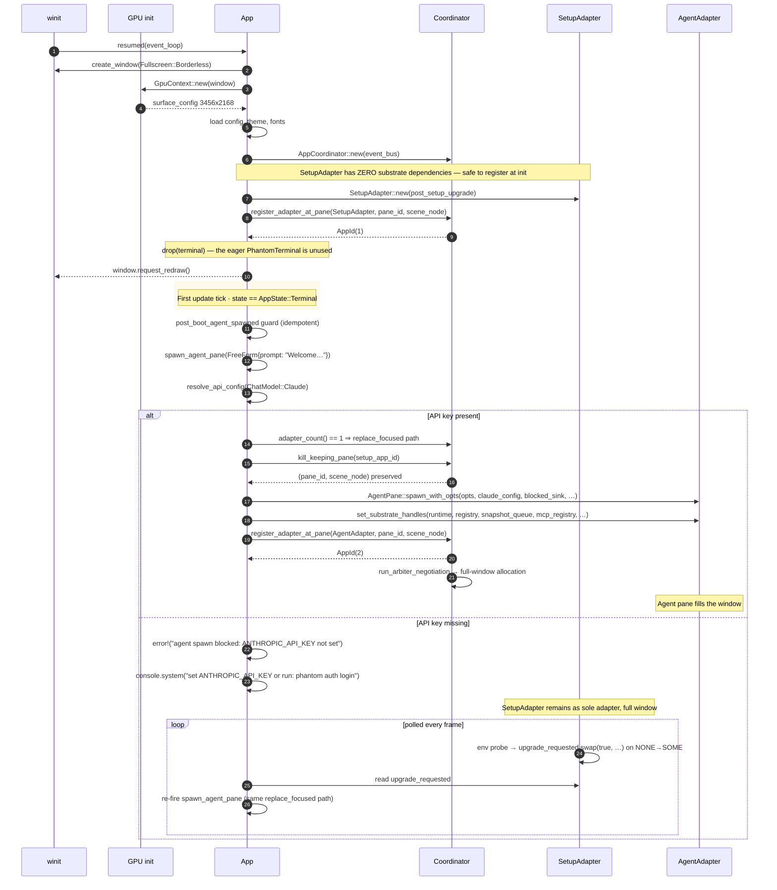

# Flow 1 · Cold launch

[← back to flows index](README.md)

The first frame a user sees after launching Phantom. Goal: a single
agent pane filling the window. No terminal, no boot animation occupying
the primary surface. Honours the "Phantom IS the AI" invariant — the
terminal is a secondary surface summonable via `Cmd+T`, never the default.

## Architecture decisions this flow honours

- [ADR-001 · Architecture decisions](../decisions/001-architecture.md) — the
  AppAdapter trait, the supervisor model, the substrate's two-process
  architecture.
- [ADR-003 · App lifecycle + pub-sub](../decisions/003-pubsub.md) — adapter
  registration emits bus events; subscribers (brain, inspector) react.

## Participants

- **winit** — the OS window owner. Opens borderless fullscreen when
  `config.fullscreen` is true.
- **GPU init** — `wgpu` adapter probe, surface configuration. See
  [rendering](../components/rendering.md).
- **App** — `phantom-app` orchestrator. See [substrate](../components/substrate.md).
- **SetupAdapter** — the dependency-free initial adapter (zero substrate
  handles needed at registration time). Renders a "waiting for API key" or
  "initialising" status card.
- **Coordinator** — `AppCoordinator`, the registry of adapters with their
  pane / scene mappings. See [substrate](../components/substrate.md).
- **AgentAdapter** — the real agent, wrapping an `AgentPane` and the Claude
  API stream. See [agents](../components/agents.md).

## Sequence

**GAP** · [arbiter-leftover](../gaps.md#gap-arbiter-leftover) — arbiter
Phase 3 only redistributes leftover height to adapters below their
`preferred_h`; unbounded `max_size: None` adapters that have already reached
`preferred_h` don't grow. Worked around by setting agent's
`preferred_size: (500, 200)` (larger than any monitor).

**GAP** · [silent-spawn-failure](../gaps.md#gap-silent-spawn-failure) —
fixed: `spawn_agent_pane` now logs `error!` + emits a console line on
missing API key.

**GAP** · [cmd-t-from-setup](../gaps.md#gap-cmd-t-from-setup) — fixed:
`Cmd+T` from a SetupAdapter swaps in a full-window TerminalAdapter instead
of splitting half-and-half.

## Walkthrough

1. **winit creates the window** — `phantom/src/main.rs::resumed` opens a
   borderless fullscreen window when `config.fullscreen == true`. The
   default is `true` on this branch (the "agent is king" invariant).
2. **GPU initialisation** — `wgpu` picks a backend (Metal on macOS, Vulkan
   on Linux, D3D12 on Windows). `GpuContext::new(window)` configures the
   surface for the window's drawable size.
3. **App construction** — `App::with_config_scaled` builds the App
   struct: layout engine, scene graph, theme, font atlas, event bus,
   coordinator. ~600 lines of init in `app.rs`.
4. **SetupAdapter registered as sole initial adapter** — at
   `app.rs:1100-1140`, the coordinator binds a fresh `SetupAdapter` to the
   pre-allocated pane + scene node. Crucially: the eager
   `terminal: PhantomTerminal` constructed earlier in the function is
   dropped here — no terminal adapter is registered.
5. **First frame fires** — winit dispatches `window.request_redraw`; the
   App's first update tick runs. `state == AppState::Terminal` because
   `skip_boot = true` (operator config) or the boot animation completed.
6. **post_boot_agent_spawned guard** — `update.rs` checks an idempotent
   flag; if false, sets it true and calls `spawn_agent_pane`.
7. **spawn_agent_pane resolves the API config** — branches on whether
   `ANTHROPIC_API_KEY` (or `OPENAI_API_KEY`) is set.
8. **Happy path: kill_keeping_pane swap** — `adapter_count() == 1` triggers
   the replace-focused branch. `coordinator::kill_keeping_pane(setup_id)`
   removes the SetupAdapter from the registry BUT preserves its pane +
   scene node. The agent's adapter binds to the exact same slot.
9. **Substrate handles wired** — the new `AgentPane` gets clones of the
   runtime registry, event log, snapshot queue, MCP registry, blocked-event
   sink, quarantine registry, TTS pipeline, ticket dispatcher, etc.
   Substrate wiring is the cross-cutting concern that prevents
   `SetupAdapter` from being the initial agent (it has no substrate
   deps, by design — that's why the cold-launch puts it first).
10. **AgentAdapter registered, focus set** —
    `coordinator::register_adapter_at_pane` adds the agent at
    `(pane_id, scene_node)`, calls `run_arbiter_negotiation`, sets focus.
    The agent now owns the full window.
11. **Failure path: SetupAdapter persists** — when no API key is available,
    the spawn returns `None` with a loud error log + a `console.system`
    line. The SetupAdapter polls env vars on each `update(dt)`; on a
    NONE→SOME transition it flips a shared `Arc<AtomicBool>` flag. App
    sees the flag on the next update tick, re-fires `spawn_agent_pane`,
    and we're back on the happy path.

## Source files

| Concept | File |
|---|---|
| Window + GPU init | [`crates/phantom/src/main.rs`](../../../../crates/phantom/src/main.rs) |
| App orchestrator | [`crates/phantom-app/src/app.rs`](../../../../crates/phantom-app/src/app.rs) |
| SetupAdapter | [`crates/phantom-app/src/adapters/setup.rs`](../../../../crates/phantom-app/src/adapters/setup.rs) |
| spawn_agent_pane | [`crates/phantom-app/src/agent_pane/spawn.rs`](../../../../crates/phantom-app/src/agent_pane/spawn.rs) |
| kill_keeping_pane | [`crates/phantom-app/src/coordinator.rs`](../../../../crates/phantom-app/src/coordinator.rs) |
| Update tick + upgrade flag | [`crates/phantom-app/src/update.rs`](../../../../crates/phantom-app/src/update.rs) |
| Arbiter Phase 3 | [`crates/phantom-ui/src/arbiter.rs`](../../../../crates/phantom-ui/src/arbiter.rs) |
