# Flow 3 · Loop tick (triager → implementer → reviewer)

[← back to flows index](README.md)

The autonomy pipeline. `phantom loop run` runs headless (no GUI required)
on a target repository, spawning a chain of role-specialised agents that
classify, implement, and review work. Each loop iteration pulls typed
input from a `LoopSource`, dispatches a sub-agent with
`requires_complete_task=true`, validates the agent's structured exit
against the loop's `ExitSchema`, and fires `on_complete` effects to hand
off to the next loop.

## Architecture decisions this flow honours

- [ADR-001 · Architecture decisions](../decisions/001-architecture.md) — the
  harness control properties: per-role tool whitelists, external state
  machine (`TaskLedger`), structured exit (`complete_task`), typed
  inter-agent messaging.

## Participants

- **`phantom loop run`** — the headless CLI entrypoint. See
  [substrate](../components/substrate.md).
- **Preflight** — `check_gh_binary`, `check_gh_auth`, `check_mcp_collisions`.
- **RunLock** — `<repo>/.phantom/loops/.runlock`, exclusive file lock that
  releases on `Drop` (Ctrl-C, process exit).
- **LoopRegistry** — owns the live `LoopRunner` instances by name.
- **LoopRunner** — the per-loop async FSM (Idle → Pulling → Dispatching →
  Awaiting → Completing → Idle).
- **LoopSource** — pluggable input. Variants: `CronSource`,
  `LoopMessageQueueSource`, `GhIssueQueueSource`, `GhPrReviewQueueSource`.
- **SubstrateAgentDispatcher** — translates a typed input into an
  `AgentSpawnOpts` with `requires_complete_task=true`.
- **SubstrateDriver** — the headless replacement for the GUI App.
- **ExitSchema** — per-loop schema for the `complete_task` payload.
- **LoopQueueRegistry** — typed `LoopMessage` fan-out across loops.

## Sequence

```mermaid
sequenceDiagram
    autonumber
    participant CLI as phantom loop run
    participant Pre as Preflight
    participant Lock as RunLock
    participant Reg as LoopRegistry
    participant Runner as LoopRunner
    participant Src as LoopSource
    participant Disp as SubstrateAgentDispatcher
    participant Drv as SubstrateDriver
    participant Agent as Sub-agent (Claude)
    participant Schema as ExitSchema
    participant QReg as LoopQueueRegistry

    CLI->>Pre: check_gh_binary / check_gh_auth / check_mcp_collisions
    Pre-->>CLI: ok
    CLI->>Lock: acquire(<repo>/.phantom/loops/.runlock)
    Lock-->>CLI: held
    CLI->>Reg: register(triager, implementer, reviewer)
    Reg->>Runner: spawn each

    loop per tick
        Runner->>Src: next()
        alt input ready
            Src-->>Runner: LoopInput { typed payload }
            Runner->>Disp: SpawnSubagentRequest { role, task, requires_complete_task: true }
            Disp->>Drv: push onto spawn queue
            Drv->>Drv: drive ChatBackedSubstrateBackend
            Drv->>Agent: stream task to Claude
            loop streaming
                Agent-->>Drv: tool_use / text deltas
                Drv->>Drv: dispatch_tool via capability gate
            end
            Agent-->>Drv: tool_use { name: "complete_task", input: payload }
            Drv->>Schema: validate(payload)
            alt valid
                Schema-->>Drv: ok
                Drv-->>Runner: AgentTaskComplete { agent_id, payload }
                Runner->>Runner: on_complete LoopEffects
                Runner->>QReg: EnqueueTo(downstream loop, LoopMessage{…})
            else invalid 3x
                Schema-->>Drv: validation_failure
                Drv->>Drv: validation_failure_count++ (per pane)
                opt count == 3
                    Drv->>Drv: flatline pane
                end
            end
        else no input
            Runner->>Runner: sleep(tick_interval)
        end
    end

    Note over CLI: Ctrl-C → Drop → RunLock released
```

**GAP** · [loop-mid-flight-cancel](../gaps.md#gap-loop-mid-flight-cancel) —
no graceful `phantom loop stop` CLI; Ctrl-C SIGTERMs in-flight agents.

**GAP** · [loop-exit-schema-error-uplift](../gaps.md#gap-loop-exit-schema-error-uplift) —
schema validation failures flatline the pane but the error reason isn't
surfaced inline.

**GAP** · [loop-quarantine-cascade-ux](../gaps.md#gap-loop-quarantine-cascade-ux) —
quarantine state is recorded but not visible in the Inspector pane.

**GAP** · [loop-watchdog-vs-supervisor](../gaps.md#gap-loop-watchdog-vs-supervisor) —
two unrelated restart-loop concepts (`phantom-loop-forever.sh` and
`phantom-supervisor`).

## Walkthrough

1. **`phantom loop run --repo X --loops a,b,c`** — the operator launches
   the headless loop runner. No GUI is needed; this is the pipeline that
   lets Phantom modify its own codebase autonomously.
2. **Preflight gates** — `check_gh_binary` (gh on PATH), `check_gh_auth`
   (logged in), `check_mcp_collisions` (no MCP tool names colliding with
   the reserved `complete_task` / `abort_task` lifecycle names).
3. **RunLock acquired** — exclusive file lock at
   `<repo>/.phantom/loops/.runlock`. Released on Ctrl-C via `Drop`.
4. **LoopRegistry registers each loop** — each named loop in `--loops`
   spins up a `LoopRunner` FSM. The `.phantom/loops/<name>.toml` spec
   file declares the source, the agent role, the ExitSchema, and the
   `on_complete` effects.
5. **Per-tick poll** — each runner calls its `LoopSource::next()`.
6. **Dispatch with `requires_complete_task: true`** —
   `SubstrateAgentDispatcher` builds `AgentSpawnOpts`. This tells the
   lifecycle wiring that the sub-agent MUST end its turn with a
   `complete_task` tool call.
7. **SubstrateDriver runs the agent** — the headless equivalent of the
   GUI's `App::update`. Drains the spawn queue, instantiates a
   `ChatBackedSubstrateBackend`, streams to Claude, dispatches tool calls
   through the same capability gate as Flow 2.
8. **`complete_task` arrives** — the sub-agent emits its structured exit.
   `ExitSchema::validate(payload)` checks the loop spec's schema.
9. **Validation succeeds** — `AgentTaskComplete` event fires; the
   runner's `on_complete` `LoopEffects` execute.
10. **Validation fails 3x** — `validation_failure_count` increments; on
    the third consecutive invalid `complete_task`, the pane flatlines.
11. **Tick repeats** — runner sleeps until the next source poll.

## Source files

| Concept | File |
|---|---|
| CLI entry | [`crates/phantom/src/loop_cli.rs`](../../../../crates/phantom/src/loop_cli.rs) |
| LoopRunner FSM | [`crates/phantom-loop/src/runner/fsm.rs`](../../../../crates/phantom-loop/src/runner/fsm.rs) |
| LoopSource trait | [`crates/phantom-loop/src/runner/source.rs`](../../../../crates/phantom-loop/src/runner/source.rs) |
| SubstrateAgentDispatcher | [`crates/phantom-loop/src/runner/dispatcher.rs`](../../../../crates/phantom-loop/src/runner/dispatcher.rs) |
| Loop spec TOMLs | [`.phantom/loops/triager.toml`](../../../../.phantom/loops/triager.toml) (also `implementer.toml`, `reviewer.toml`) |
