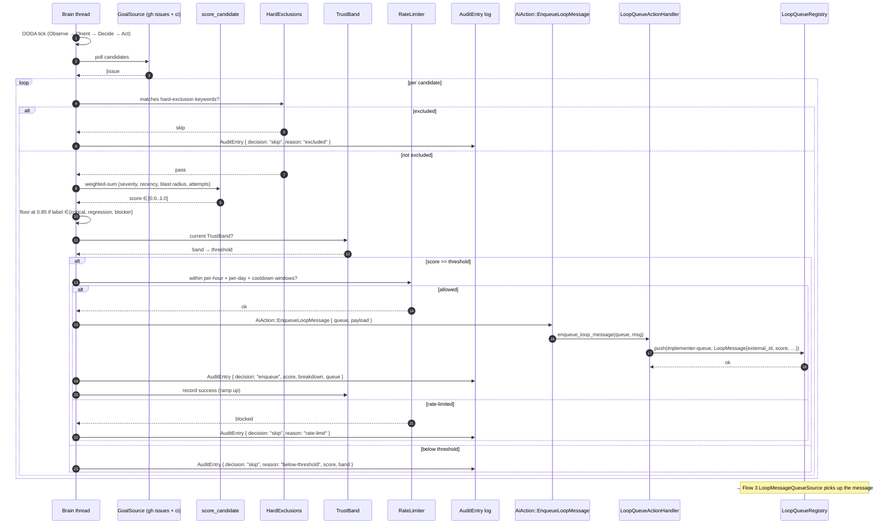

# Flow 4 · Brain self-improvement (phantom-on-phantom)

[← back to flows index](README.md)

The brain pulls candidate work from GitHub (its own repository,
`jdmiranda/phantom`), scores each candidate, applies hard exclusions +
rate limits + a trust budget, and enqueues the highest-scoring item onto
a downstream loop queue. From there, Flow 3 takes over.

## Architecture decisions this flow honours

- [ADR-001 · Architecture decisions](../decisions/001-architecture.md) — the
  brain runs on its own thread, scores with utility AI.

See the long-form design at
[`docs/design/brain-self-improvement.md`](../../../design/brain-self-improvement.md).

## Participants

- **GoalSource** — trait with two production impls:
  - `GhIssueGoalSource` — polls `gh issue list` for open issues on
    `jdmiranda/phantom`.
  - `GhCiFailureGoalSource` — polls `gh run list` for failing workflow runs.
- **score_candidate** — weighted-sum scorer.
- **HardExclusions** — keyword filter.
- **TrustBand** — 4 autonomy bands (SuggestionOnly → Conservative →
  Standard → Aggressive).
- **RateLimiter** — per-hour / per-day ceilings + cooldown.
- **AuditEntry** — JSONL audit log.
- **AiAction::EnqueueLoopMessage** — the brain's action variant.
- **LoopQueueActionHandler** — bridge between brain actions and
  `LoopQueueRegistry`.

Downstream: [Flow 3](03-loop-tick.md) picks up from there.

## Sequence

**GAP** · [brain-trust-band-ramp-ux](../gaps.md#gap-brain-trust-band-ramp-ux) —
TrustBand ramps are invisible to the operator.

**GAP** · [brain-self-improve-opt-in](../gaps.md#gap-brain-self-improve-opt-in) —
`SelfImprovementConfig::enabled = false` by default; opt-in requires
hand-editing the config file.

**GAP** · [brain-goal-source-rate-limit](../gaps.md#gap-brain-goal-source-rate-limit) —
unauthenticated `gh` API gives 60/hr; the source silently returns empty
when rate-limited.

## Walkthrough

1. **OODA tick** — the brain runs on its own thread. Each tick runs the
   Observe / Orient / Decide / Act loop. Self-improvement is one of
   several "Orient → Decide" branches.
2. **GoalSource polls** — `GhIssueGoalSource` runs `gh issue list -R
   jdmiranda/phantom --state open --json …`; `GhCiFailureGoalSource` runs
   `gh run list --status failure --json …`.
3. **HardExclusions** — keyword filter against title / labels / body.
   Issues labelled `auto-triage-skip` are filtered.
4. **score_candidate** — weighted-sum of severity, recency, blast radius,
   prior agent attempts.
5. **CRITICAL_LABEL_FLOOR** — issues labelled `critical` / `regression` /
   `blocker` get score floored at 0.85.
6. **TrustBand** — current band determines the score threshold. Banding
   starts at Standard and ramps based on outcomes.
7. **RateLimiter** — per-hour, per-day, and per-candidate cooldown.
8. **AiAction::EnqueueLoopMessage** —
   `LoopQueueActionHandler` translates the action into a typed
   `LoopMessage` and pushes onto `LoopQueueRegistry`.
9. **AuditEntry** — every decision (enqueue OR skip) appends a JSONL row
   to the audit log path.
10. **Hand-off to Flow 3** — the loop runner pulls the message via
    `LoopMessageQueueSource` and the rest is [Flow 3](03-loop-tick.md)
    from there.

## Source files

| Concept | File |
|---|---|
| Self-improvement reconciler | [`crates/phantom-brain/src/self_improvement.rs`](../../../../crates/phantom-brain/src/self_improvement.rs) |
| GoalSource trait | [`crates/phantom-brain/src/goal_source/mod.rs`](../../../../crates/phantom-brain/src/goal_source/mod.rs) (+ `gh_issues.rs`, `gh_ci.rs`) |
| AiAction variant | [`crates/phantom-brain/src/events.rs`](../../../../crates/phantom-brain/src/events.rs) |
| Design doc | [`docs/design/brain-self-improvement.md`](../../../design/brain-self-improvement.md) |
| Loop CLI entry | [`crates/phantom/src/loop_cli.rs`](../../../../crates/phantom/src/loop_cli.rs) |
